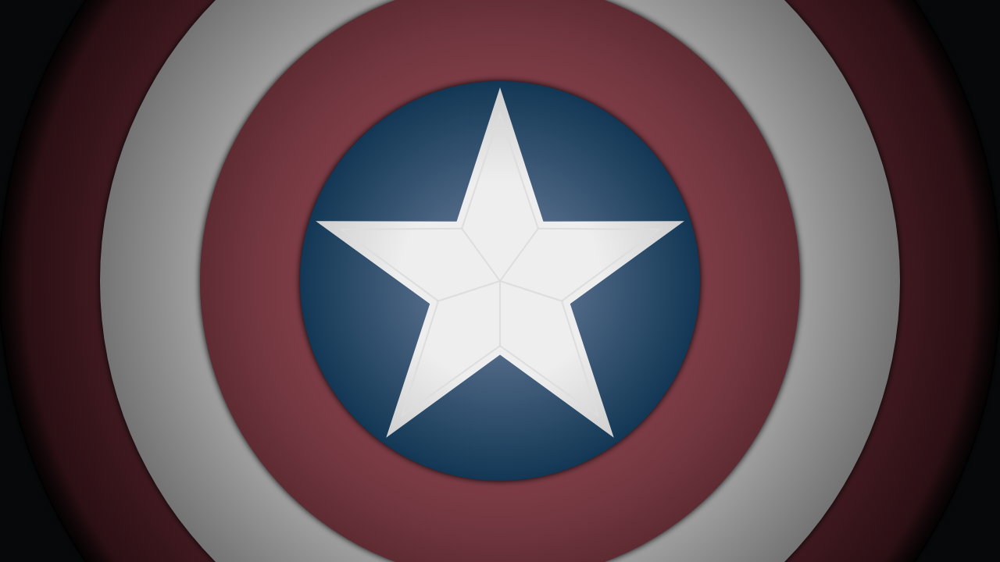

# Shield Canvas

A canvas-based animation of Captain America's shield rendered in JavaScript.

## Example



## Running Locally

Open `index.html` in a browser to view the shield animation.

## Testing with Playwright

This project includes Playwright tests that capture video and screenshots.

```bash
npm install
npx playwright install chromium
npm test
```

### Test Artifacts

After running tests, artifacts are saved to:
- `artifacts/` - Custom screenshots
- `test-results/` - Video recordings and auto-captured screenshots
